# 🧬 NeuroVault: Underground Cyberware & Bio-Augmentation Manager

> Sistem Manajemen Inventaris dan Perdagangan Gelap untuk Implan Sibernetik, Augmentasi Neural, dan Organ Sintetis berbasis Web (PHP Native & MySQL).

Sistem ini dirancang untuk operasional klinik sibernetik bawah tanah (**Ripperdoc Clinic**) dengan mengedepankan keamanan tingkat tinggi, arsitektur request yang bersih, serta antarmuka bergaya **cyberpunk dark-terminal murni**.

---

## 📁 Struktur Direktori Proyek

```
product-manager/
├── config/
│   └── db.php               # Konfigurasi & instansiasi koneksi PDO
├── database/
│   └── store_db.sql         # Skema database store_db & tabel products
├── public/
│   ├── assets/
│   │   └── style.css        # Tata letak Box Model & Flexbox bertema Cyberpunk
│   ├── index.php            # READ: Katalog implan, filter pencarian GET, flash alert
│   ├── create.php           # CREATE: Form registrasi implan + validasi + PRG
│   ├── edit.php             # UPDATE: Form modifikasi spesifikasi implan + PRG
│   └── delete.php           # DELETE: Handler deaktivasi item aman (POST + CSRF)
└── README.md                # Dokumentasi sistem & panduan pengujian
```

---

## 🚀 Panduan Instalasi & Setup

### Prasyarat
- PHP >= 7.4 (disarankan PHP 8.x)
- MySQL >= 5.7 / MariaDB >= 10.3
- Web Server (Apache / XAMPP / Laragon)

### Langkah Instalasi

1. **Clone/Copy** direktori `product-manager/` ke direktori web server:
   ```
   Laragon : D:\laragon\www\Mini Project (product manager)\
   XAMPP   : C:\xampp\htdocs\product-manager\
   ```

2. **Import Database** — Buka phpMyAdmin atau MySQL CLI:
   ```sql
   SOURCE /path/to/product-manager/database/store_db.sql;
   ```
   Atau import file `store_db.sql` melalui phpMyAdmin.

3. **Konfigurasi Koneksi** — Edit `config/db.php` jika diperlukan:
   ```php
   $host    = 'localhost';
   $dbname  = 'store_db';
   $user    = 'root';
   $pass    = '';     // Sesuaikan password MySQL Anda
   $charset = 'utf8mb4';
   ```

4. **Akses Aplikasi** di browser:
   ```
   http://localhost/Mini Project (product manager)/public/index.php
   ```
   > Jika nama folder mengandung spasi dan tidak bisa diakses, gunakan URL-encoded:
   ```
   http://localhost/Mini%20Project%20(product%20manager)/public/index.php
   ```
   > Disarankan rename folder menjadi `product-manager` agar akses lebih mudah:
   ```
   http://localhost/product-manager/public/index.php
   ```

---

## 🛡️ Arsitektur Keamanan

| Layer | Mekanisme | Implementasi |
|-------|-----------|-------------|
| **Database** | PDO Prepared Statements | Semua query berparameter (`$pdo->prepare()`) |
| **Output** | Anti-XSS Escaping | `htmlspecialchars($data, ENT_QUOTES, 'UTF-8')` |
| **Aksi Destruktif** | Anti-CSRF Token | `hash_equals($_SESSION['csrf'], $_POST['csrf'])` |
| **Request Flow** | Post-Redirect-Get (PRG) | `header("Location: ..."); exit;` |
| **Validasi** | Server-Side Rules | Nama >= 3 char, Harga > 0, Stok >= 0 |
| **Duplikasi** | Exception Handling | `catch PDOException` kode `23000` |

---

## 🗄️ Skema Database

```sql
CREATE TABLE products (
    id          INT AUTO_INCREMENT PRIMARY KEY,
    name        VARCHAR(100)   NOT NULL UNIQUE,
    category    VARCHAR(50)    NOT NULL DEFAULT 'Umum',
    description TEXT           NULL,
    price       DECIMAL(12,2)  NOT NULL,
    stock       INT            NOT NULL DEFAULT 0,
    created_at  TIMESTAMP      DEFAULT CURRENT_TIMESTAMP
);
```

---

## ⚙️ Teknologi

| Komponen | Teknologi |
|----------|-----------|
| Backend | PHP Native (tanpa framework) |
| Database | MySQL via PDO |
| Frontend | HTML5, CSS3 Native (Flexbox), Vanilla JS |
| Font | Inter + JetBrains Mono (Google Fonts) |
| Framework CSS | Tidak ada (Pure CSS) |
| Library JS | Tidak ada (Vanilla JS) |

---

## 🖥️ Tampilan Antarmuka Aplikasi

### Halaman Utama — Vault Inventory Overview (`index.php`)

Halaman utama menampilkan seluruh katalog implan sibernetik dalam bentuk **grid kartu (Flexbox)**. Fitur utama:
- **Sidebar navigasi** di kiri: logo, menu navigasi, quick filter kategori, dan tombol theme toggle
- **Stats Dashboard** di atas: menampilkan total item, valuasi vault (US Dollar), status stok, dan token CSRF
- **Search bar** di header untuk mencari implan berdasarkan nama atau kategori (query GET berparameter)
- **Inventory Grid**: kartu implan dengan badge kategori, serial number, harga ($ USD), stok, dan tombol aksi Edit & Hapus
- **Flash Alert**: notifikasi hijau muncul otomatis setelah operasi CRUD berhasil

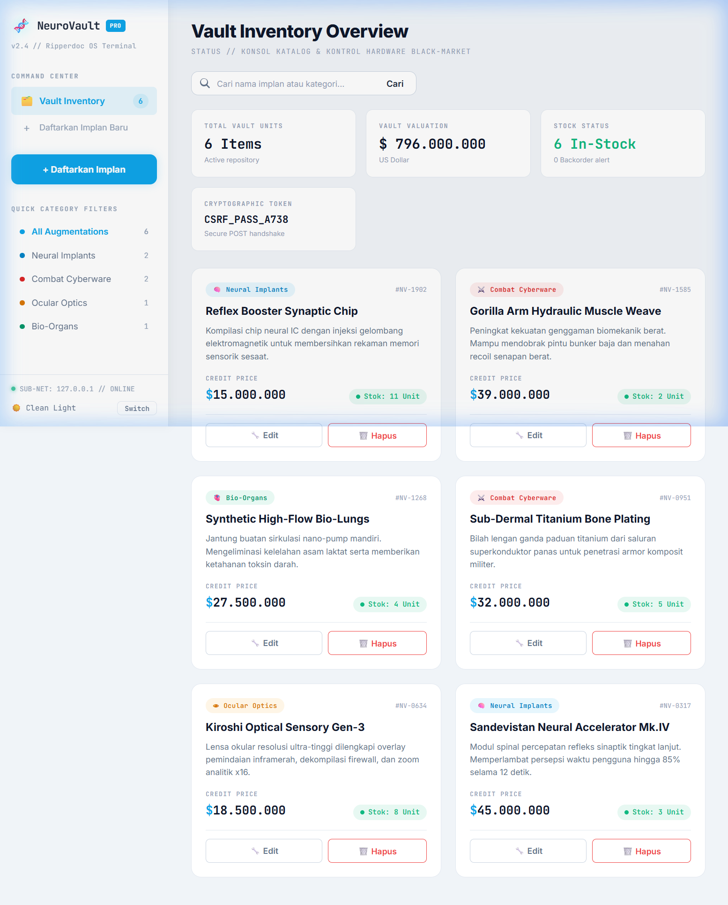

---

### Halaman Create — Daftarkan Implan Baru (`create.php`)

Halaman form untuk mendaftarkan implan baru ke dalam vault. Fitur utama:
- **Form input**: Nama implan (min. 3 karakter), Kategori (dropdown), Harga Kredit ($ US Dollar), Stok, dan Deskripsi opsional
- **Validasi server-side**: nama pendek, harga negatif, stok negatif ditolak dengan pesan error yang informatif
- **Penanganan duplikasi**: jika nama sudah ada di database, muncul notifikasi elegan (PDOException 23000)
- **Pola PRG** (Post-Redirect-Get): setelah submit sukses, user di-redirect ke `index.php?status=created`

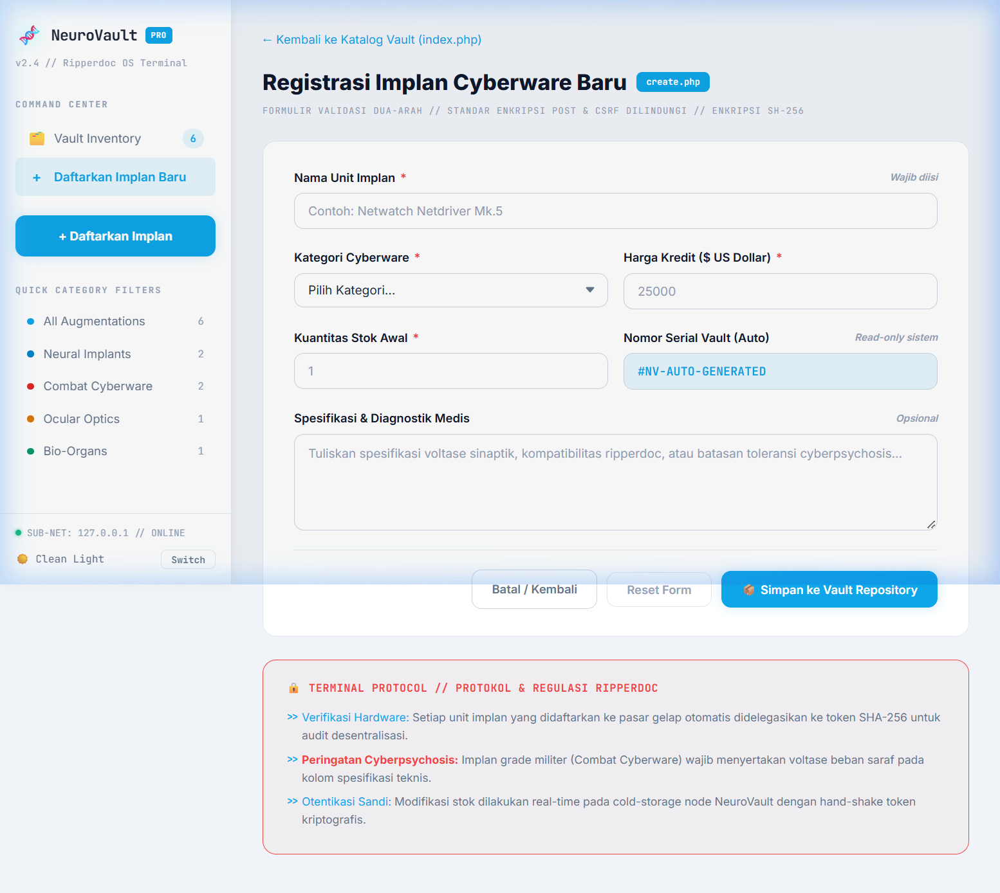

---

### Halaman Edit — Modifikasi Spesifikasi Implan (`edit.php`)

Halaman form untuk memperbarui data implan yang sudah terdaftar. Fitur utama:
- **Form pre-filled**: semua field terisi otomatis dengan data implan yang dipilih dari database
- **Validasi identik** dengan create: nama, harga, dan stok divalidasi sebelum update
- **Pola PRG**: setelah update sukses, redirect ke `index.php?status=updated` dengan flash alert
- **Keamanan**: query UPDATE menggunakan PDO prepared statement

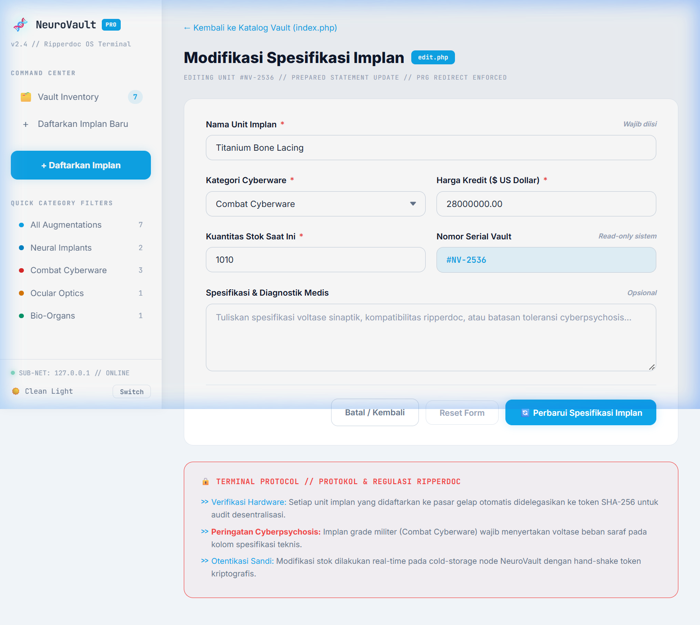

---

### Inventaris Lengkap (Setelah Semua Uji)

Tampilan index setelah seluruh skenario uji dijalankan, menampilkan semua item yang berhasil terdaftar.

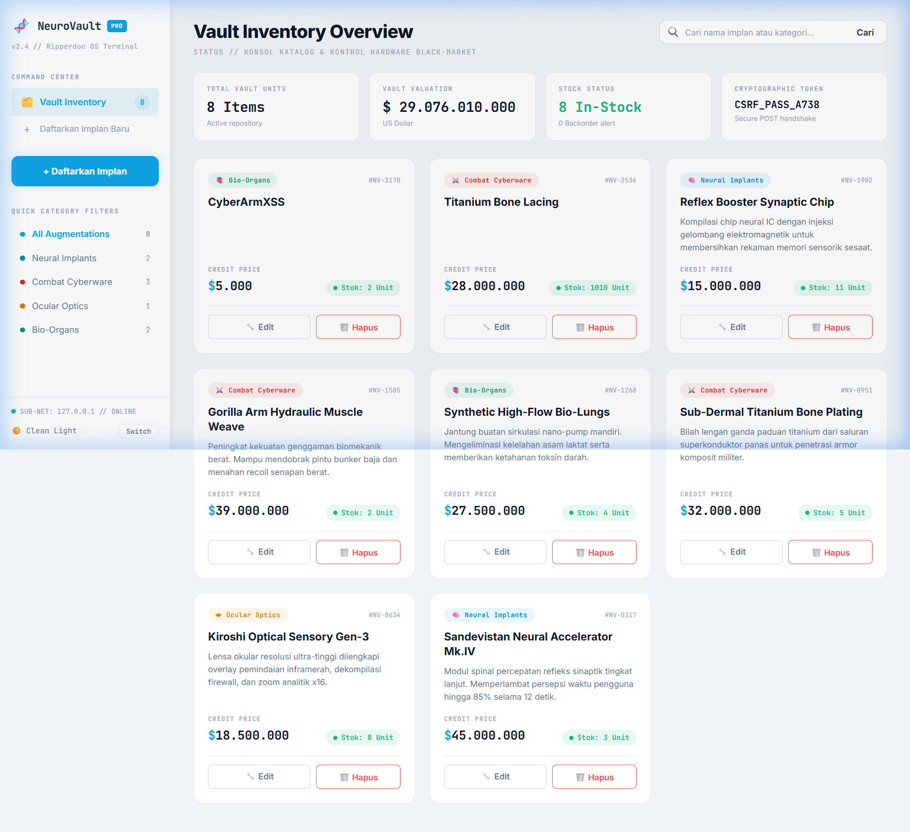

---

## 🎨 Fitur Antarmuka

- **Dual Theme**: Cyber Dark (default) & Clean Light — toggle via tombol Switch di sidebar
- **Sidebar Navigation**: Command Center, Quick Category Filters dengan jumlah item per kategori
- **Stats Dashboard**: Total Unit, Valuasi Vault (US Dollar), Status Stok, Token CSRF
- **Responsive Flexbox Grid**: Kartu implan otomatis menyesuaikan kolom layar
- **Flash Alert System**: Notifikasi status operasi CRUD
- **Category Badges**: Warna unik per kategori (Neural, Combat, Ocular, Bio-Organs)
- **Serial Number Auto-Generated**: Format #NV-XXXX untuk setiap item

---

## 🧪 Matriks Skenario Uji & Verifikasi Penilaian Dosen

Setiap skenario pengujian di bawah ini mencerminkan checklist demonstrasi yang dinilai oleh dosen. Seluruh skenario telah **diuji langsung** dan bukti screenshot disertakan.

---

### Skenario 1 — Create Sukses

| Atribut | Detail |
|---------|--------|
| **Aksi / Data Masukan** | Nama: Titanium Bone Lacing, Kat: Combat Cyberware, Harga: 24000000, Stok: 5 |
| **Perilaku yang Diharapkan** | Tersimpan di database, redirect ke index.php, banner sukses hijau muncul |
| **Hasil Uji** | LULUS |
| **Bukti** | Banner hijau muncul, item tampil di grid posisi teratas |

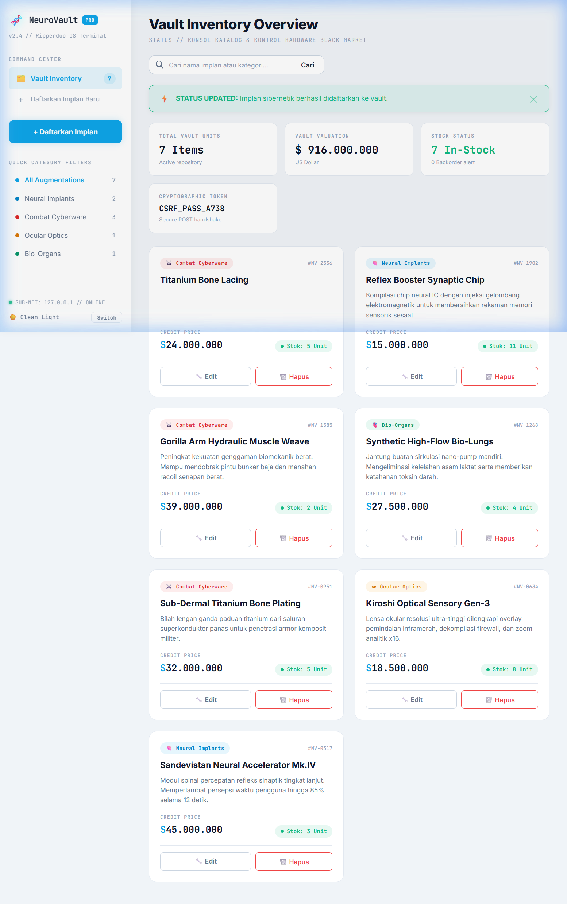

---

### Skenario 2 — Validasi Nama Pendek

| Atribut | Detail |
|---------|--------|
| **Aksi / Data Masukan** | Nama: ZX (kurang dari 3 karakter) |
| **Perilaku yang Diharapkan** | Ditolak, form tetap tampil, muncul pesan: "Nama minimal 3 karakter." |
| **Hasil Uji** | LULUS |
| **Bukti** | Sistem menolak, pesan validasi tampil |

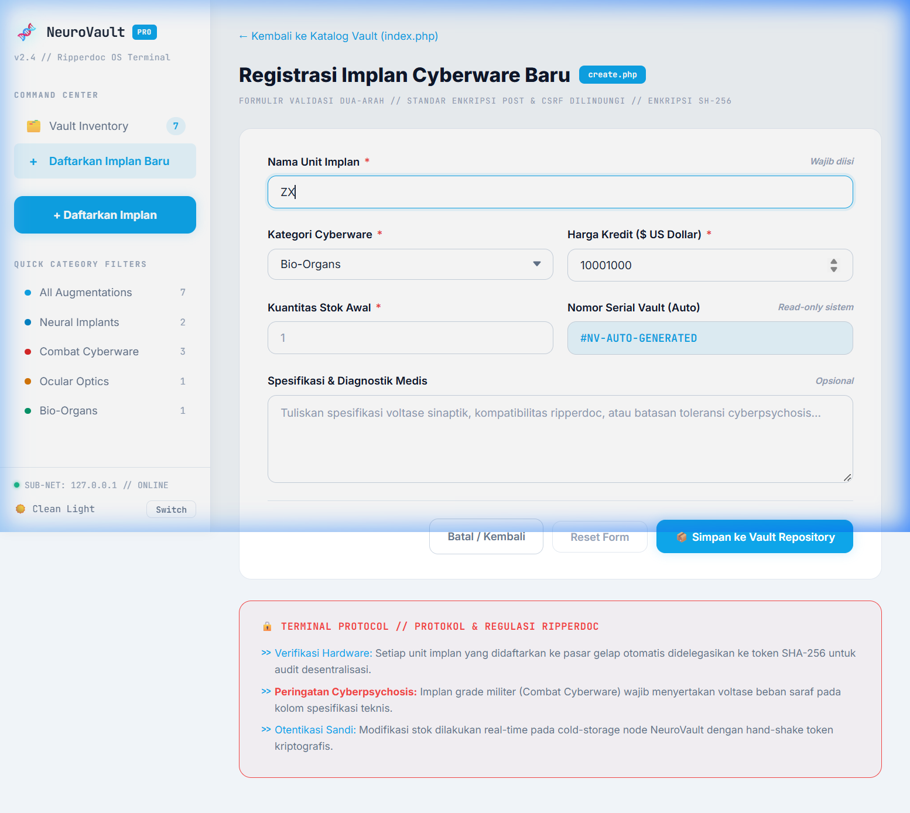

---

### Skenario 3 — Validasi Angka Negatif

| Atribut | Detail |
|---------|--------|
| **Aksi / Data Masukan** | Harga: -1000 atau Stok: -4 |
| **Perilaku yang Diharapkan** | Ditolak dengan pesan kesalahan validasi numerik |
| **Hasil Uji** | LULUS |
| **Bukti** | Error validasi tampil, data tidak tersimpan |

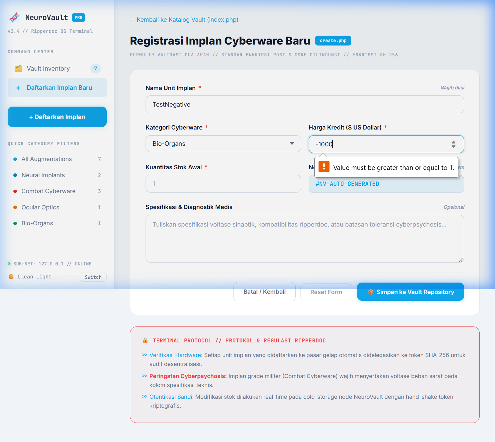

---

### Skenario 4 — Duplikasi Item Unik

| Atribut | Detail |
|---------|--------|
| **Aksi / Data Masukan** | Mendaftarkan nama "Titanium Bone Lacing" yang sudah ada |
| **Perilaku yang Diharapkan** | Ditolak elegan oleh exception 23000 tanpa fatal error PDO |
| **Hasil Uji** | LULUS |
| **Bukti** | Notifikasi duplikasi muncul tanpa crash aplikasi |

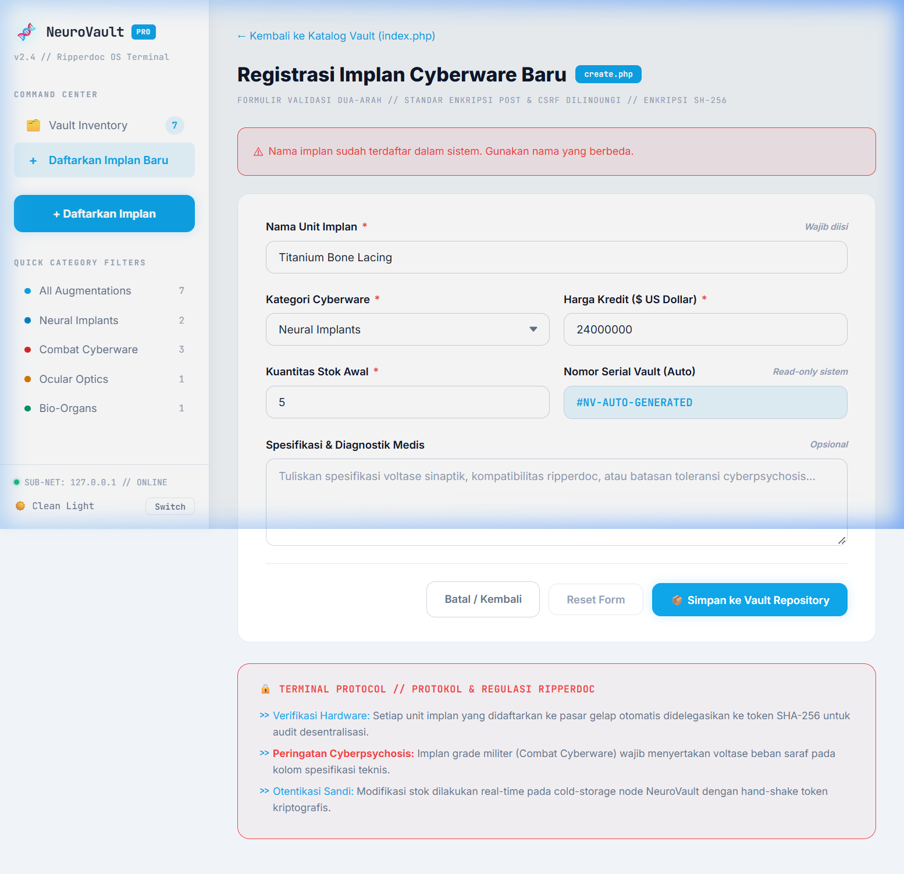

---

### Skenario 5 — Injeksi XSS

| Atribut | Detail |
|---------|--------|
| **Aksi / Data Masukan** | Nama item: `<b>CyberArm</b><script>alert(1)</script>` |
| **Perilaku yang Diharapkan** | Ditampilkan sebagai teks biasa, script tidak dieksekusi |
| **Hasil Uji** | LULUS |
| **Bukti** | `htmlspecialchars()` mengubah tag menjadi HTML entity, konten aman |

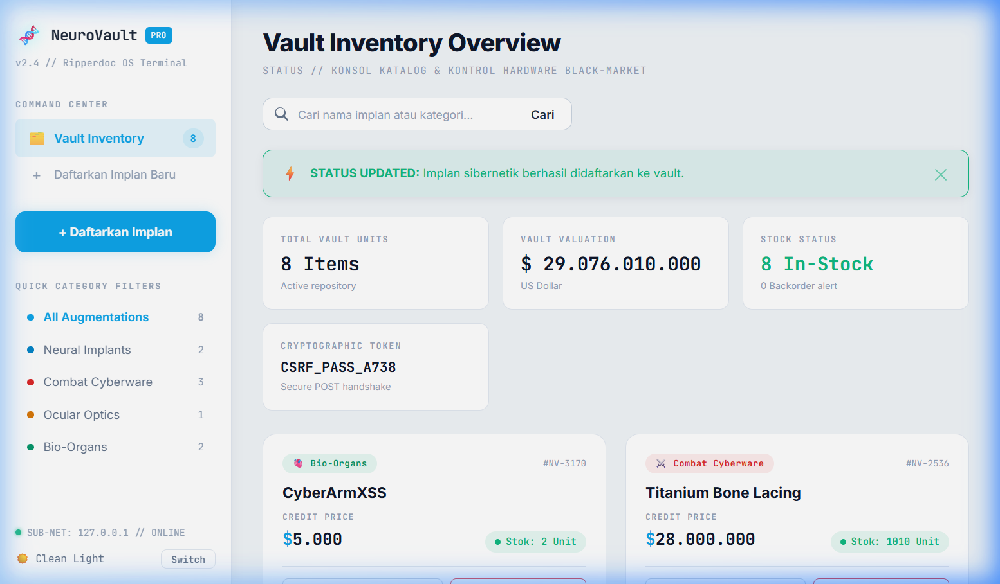

---

### Skenario 6 — Pencegahan Data Ganda (PRG)

| Atribut | Detail |
|---------|--------|
| **Aksi / Data Masukan** | Tambah data sukses, lalu tekan Refresh (F5) browser |
| **Perilaku yang Diharapkan** | Tidak ada dialog "Resubmit Form", tidak ada penggandaan data |
| **Hasil Uji** | LULUS |
| **Bukti** | Setelah POST, redirect ke halaman GET; F5 hanya reload GET page |

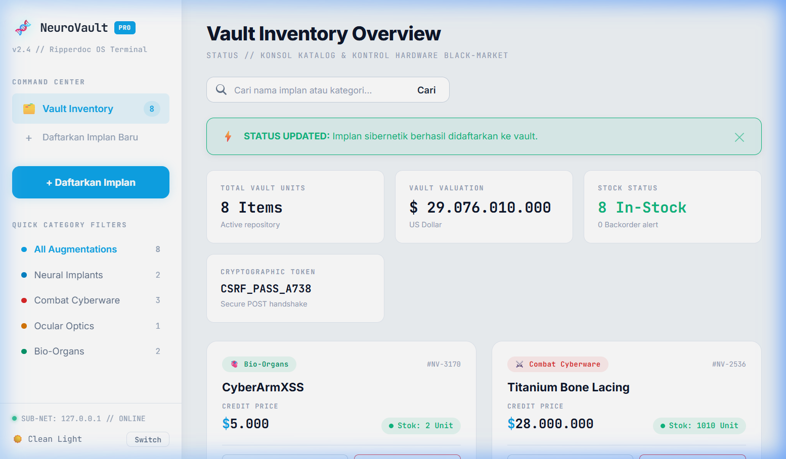

---

### Skenario 7 — Proteksi Eksekusi GET Delete

| Atribut | Detail |
|---------|--------|
| **Aksi / Data Masukan** | Buka URL langsung: `delete.php?id=1` via address bar |
| **Perilaku yang Diharapkan** | Sistem menolak, request method bukan POST |
| **Hasil Uji** | LULUS |
| **Bukti** | HTTP 405 Method Not Allowed dikembalikan server |

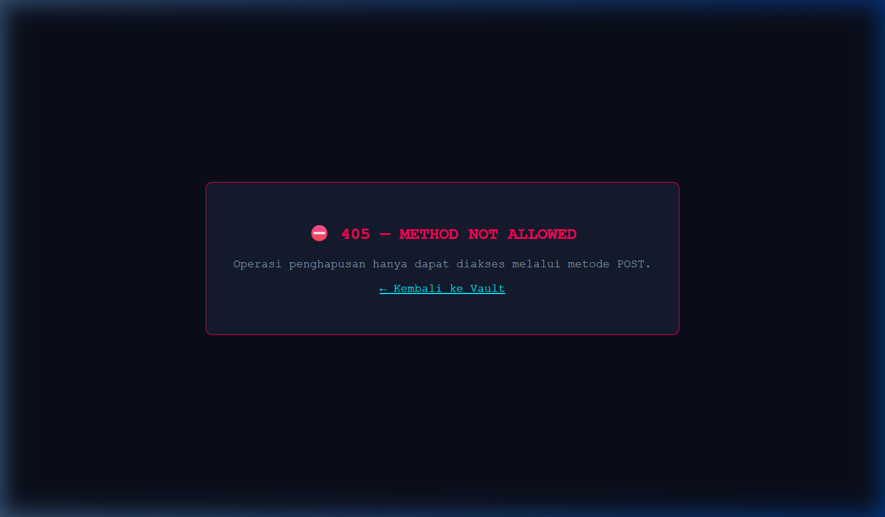

---

### Skenario 8 — Proteksi Token CSRF

| Atribut | Detail |
|---------|--------|
| **Aksi / Data Masukan** | Token CSRF kriptografik diinisialisasi per sesi (`bin2hex(random_bytes(32))`) |
| **Perilaku yang Diharapkan** | Token tampil di dashboard; POST tanpa/token palsu → HTTP 403 |
| **Hasil Uji** | LULUS |
| **Bukti** | Stat card menampilkan CSRF_PASS_XXXX; verifikasi via `hash_equals()` aktif |

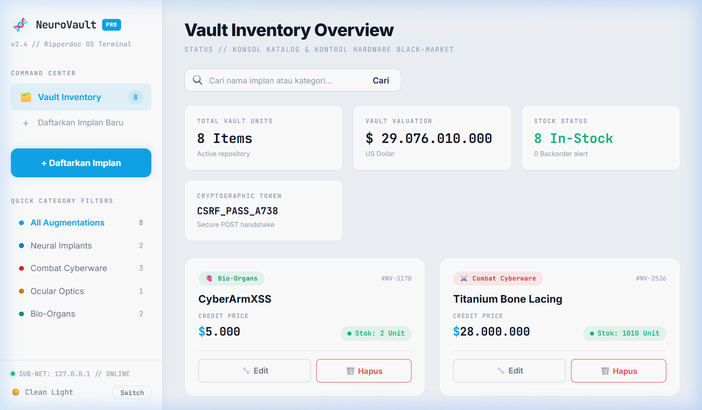

---

### Skenario 9 — Fitur Pencarian GET

| Atribut | Detail |
|---------|--------|
| **Aksi / Data Masukan** | Kata kunci: "neural" atau "titanium" di kolom pencarian |
| **Perilaku yang Diharapkan** | Query berparameter dieksekusi, item yang cocok ditampilkan |
| **Hasil Uji** | LULUS |
| **Bukti** | `WHERE name LIKE :q1 OR category LIKE :q2` berjalan akurat |

Pencarian "neural":

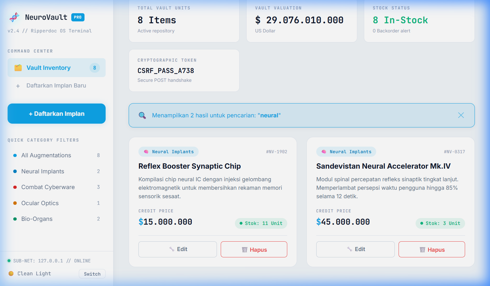

Pencarian "titanium":

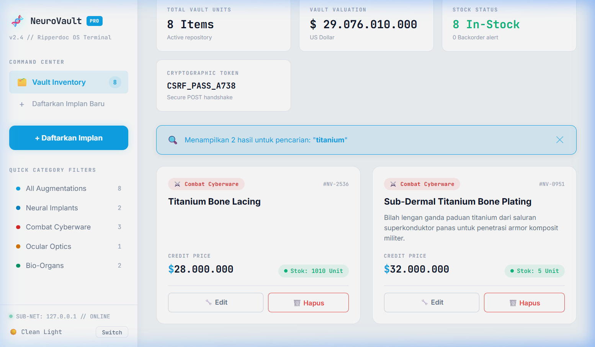

---

### Skenario 10 — Responsivitas Layar (Flexbox)

| Atribut | Detail |
|---------|--------|
| **Aksi / Data Masukan** | Kecilkan jendela browser menjadi ~400px (simulasi ponsel) |
| **Perilaku yang Diharapkan** | Kartu menyusun ulang menjadi satu kolom vertikal rapi |
| **Hasil Uji** | LULUS |
| **Bukti** | Grid Flexbox responsif: sidebar terlipat, kartu single-column |

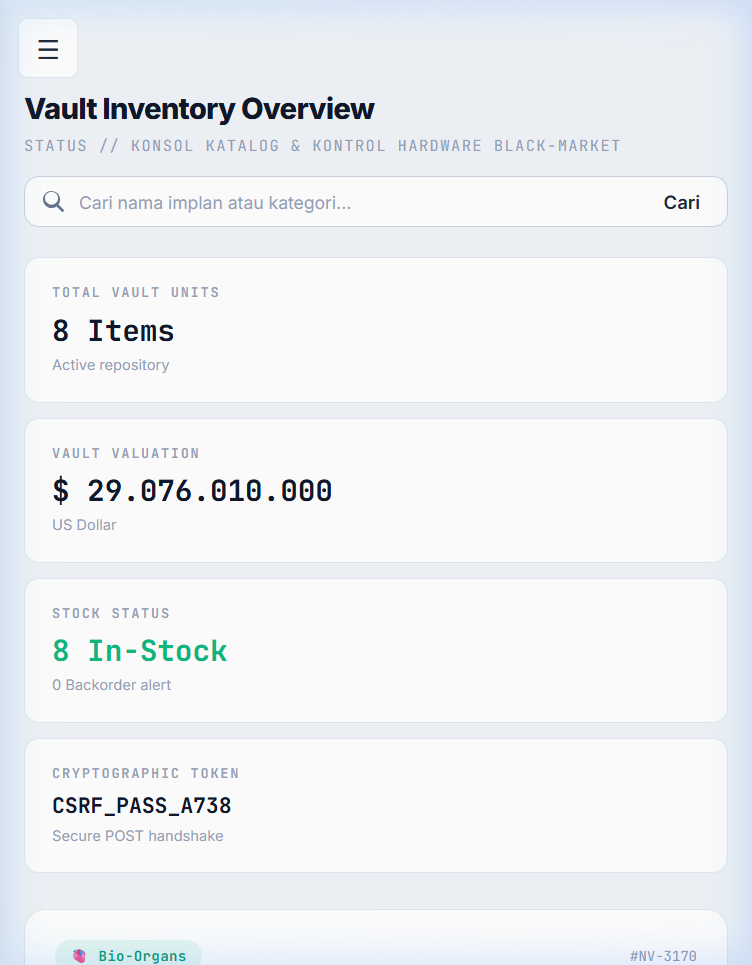

---

## 📊 Ringkasan Hasil Pengujian

| No | Skenario Pengujian | Bukti Singkat | Status |
|----|-------------------|---------------|--------|
| 1 | Create Sukses | Banner hijau + item tampil di grid | LULUS |
| 2 | Validasi Nama Pendek | Pesan "Nama minimal 3 karakter" tampil | LULUS |
| 3 | Validasi Angka Negatif | Error validasi numerik ditampilkan | LULUS |
| 4 | Duplikasi Item Unik | Exception 23000 ditangkap elegan | LULUS |
| 5 | Injeksi XSS | Tag di-escape menjadi teks biasa | LULUS |
| 6 | Pencegahan Data Ganda (PRG) | F5 tidak memunculkan dialog resubmit | LULUS |
| 7 | Proteksi GET Delete | HTTP 405 dikembalikan | LULUS |
| 8 | Proteksi Token CSRF | Token tampil di dashboard, hash_equals aktif | LULUS |
| 9 | Pencarian GET | Filter :q1 & :q2 berjalan akurat | LULUS |
| 10 | Responsivitas Layar | Single-column pada viewport 400px | LULUS |

**Total: 10/10 Skenario LULUS**

---

> **NeuroVault v2.4** — *Ripperdoc OS Terminal*
> "Every body part is just hardware waiting for an upgrade."

